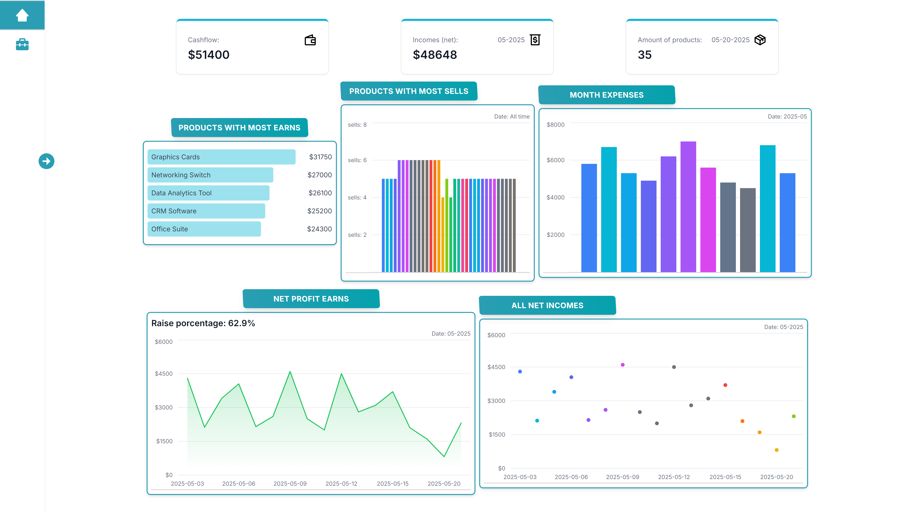
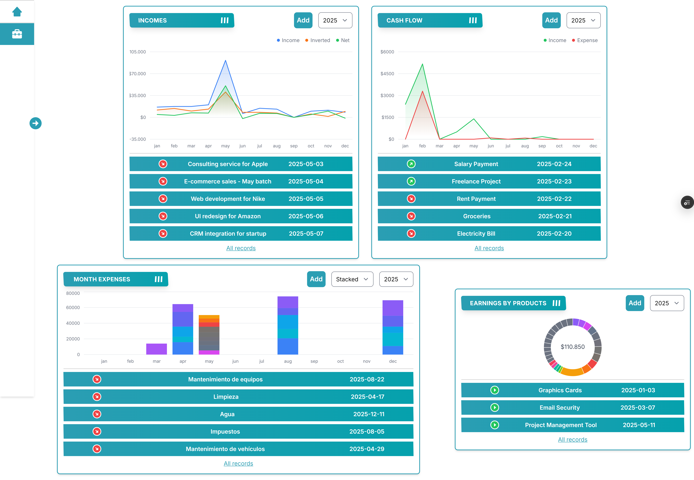

# 💼 Financial Dashboard

A modern, responsive, and intuitive financial dashboard built with **Next.js**, **TailwindCSS**, and **TypeScript**. This tool is designed for small to medium-sized businesses or independent professionals to efficiently manage and visualize their financial performance.

| Dashboard Overview                                       | Product Sales                                              |
| -------------------------------------------------------- | ---------------------------------------------------------- |
|  |  |

## 📌 Description

The Financial Dashboard allows users to manage and monitor their company’s finances in real-time. You can add incomes or withdrawals, track investments, profits, and net earnings. Additionally, it shows a monthly expense chart and a breakdown of product sales including quantity and revenue generated per item. The interface is sleek, fast, and optimized for productivity.

Whether you're a freelancer, a startup, or a growing company, this dashboard gives you the clarity you need to make better financial decisions.

---

## ⚙️ Features

### 💸 Cash Flow Control

- Register **income** and **withdrawals**
- See a real-time balance overview

### 📊 Financial Summary

- Visualize:
  - **Total investment**
  - **Total profit**
  - **Net profit**
- Understand financial trends quickly

### 🛍️ Product Sales Tracking

- Track the **number of products sold**
- See **revenue per product**
- Identify best-selling items

### 📅 Monthly Expenses Overview

- Bar charts displaying monthly expenses
- Easily spot high-cost periods

### 🧩 Modern Stack

- Elegant UI with reusable components
- Type-safe and scalable codebase
- Persistent data using **Turso** + **Drizzle ORM**

---

## 🧪 Tech Stack

- **Next.js** – React framework for fast, server-rendered applications
- **TailwindCSS** – Utility-first CSS framework for styling
- **TypeScript** – Typed JavaScript for maintainable code
- **Turso** – Lightweight, edge-hosted SQLite database
- **Drizzle ORM** – Type-safe, SQL-like ORM for data access
- **Tremor** – Elegant charts and data visualization
- **Zod** – Type-safe form validation
- **Next Auth / Custom Auth** – For secure login and token handling
- **Vercel** – Hosting and deployment

---

## 🚀 Getting Started

Clone the repository:

```bash
git clone https://github.com/your-username/financial-dashboard.git
cd financial-dashboard
```
